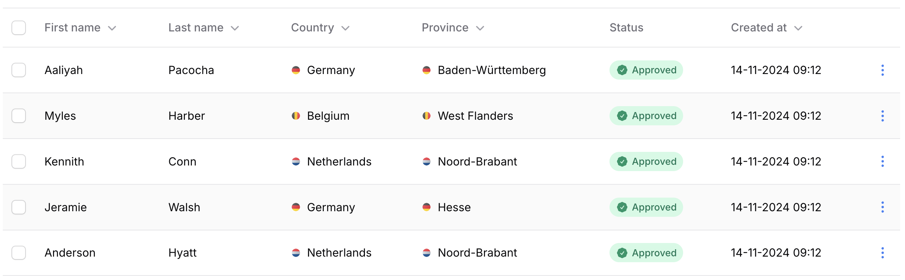
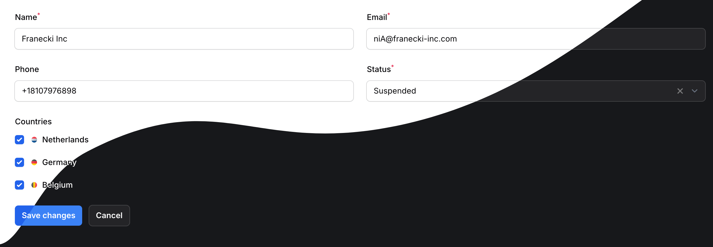
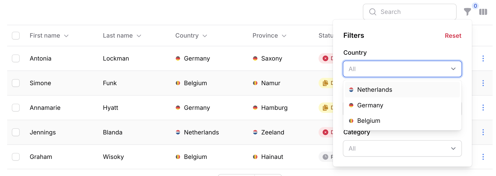
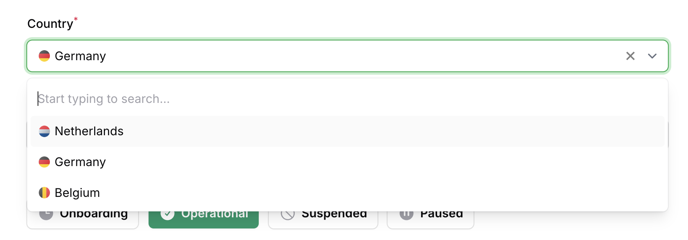
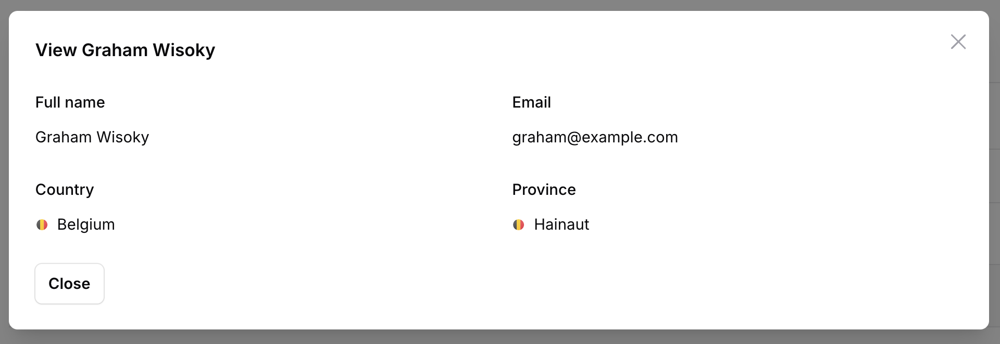

# Filament Advanced Components

This plugin extends existing **FilamentPHP 3** components with advanced features and enhanced functionality, offering more powerful and flexible options for your projects.

> [!NOTE]  
> All components are extending the default Filament components, so you can use them as you would use the default components without any issues. This package is designed to enhance the default components, not to replace them.

## Licences
Get a [lifetime license](https://checkout.anystack.sh/filament-advanced-components) for the plugin here.

## Installation instructions

Filament Advanced Components uses AnyStack to handle payment, licensing, and distribution.

To install you'll need to add the repository to your composer.json file:

```json
{
  "repositories": [
    {
      "type": "composer",
      "url": "https://filament-advanced-components.composer.sh"
    }
  ],
}
```

Once the repository has been added to the composer.json file, you can install Filament Advanced Components like any other composer package using the composer require command:

```bash
composer require codewithdennis/filament-advanced-components
```

You will be prompted to provide your username and password. The username will be the email address and the password will be equal to your license key.

```bash
Loading composer repositories with package information
Authentication required (filament-advanced-components.composer.sh):
Username: [licensee-email]
Password: [license-key]
```

## Future plans
- [ ] The ability to add badges to a column.

## Components

### AdvancedTextColumn

#### Image



You can set a **prefix** or **suffix** image for the column by passing a closure that returns the image URL.

```php
AdvancedTextColumn::make('country.name')
    ->prefixImage(fn (Country $record) => asset('images/'.$record->image))
```
```php
AdvancedTextColumn::make('country.name')
    ->suffixImage(fn (Country $record) => asset('images/'.$record->image))
```

You can change the size of the image by passing a **size** option to the component.

```php
AdvancedTextColumn::make('country.name')
    ->prefixImage(fn (Country $record) => asset('images/'.$record->image))
    ->prefixImageSize(16) // Default: 16px
```

```php
AdvancedTextColumn::make('country.name')
    ->suffixImage(fn (Country $record) => asset('images/'.$record->image))
    ->suffixImageSize(16) // Default: 16px
```

Do you have a badge-able column? No worries, the image will be displayed inside the badge.


If you want to add extra attributes to the image, you can use the **prefixImageExtraAttributes** or **suffixImageExtraAttributes** methods.

```php
AdvancedTextColumn::make('country.name')
    ->prefixImage(fn (Country $record) => asset('images/'.$record->image))
    ->prefixImageExtraAttributes([
        'class' => 'pr-4',
        'style' => 'background: red'
    ])
```

```php
AdvancedTextColumn::make('country.name')
    ->suffixImage(fn (Country $record) => asset('images/'.$record->image))
    ->suffixImageExtraAttributes([
        'class' => 'pr-4',
        'style' => 'background: red'
    ])
```

#### Mailable

A simple way to make a value clickable and open the default mail client with the email address.

```php
AdvancedTextColumn::make('email')
    ->mailable()
```

If you want to apply a mailable based on a condition, you can pass a closure that returns a boolean value.

```php
AdvancedTextColumn::make('email')
    ->mailable(fn (string $state) => str($state)->endsWith('.com'))
```

#### Callable

A simple way to make a value clickable and open the default phone client with the phone number.

```php
AdvancedTextColumn::make('phone')
    ->callable()
```

If you want to apply a callable based on a condition, you can pass a closure that returns a boolean value.

```php
AdvancedTextColumn::make('phone')
    ->callable(fn (string $state) => str($state)->startsWith('+')),
```

#### WhatsApp

A simple way to make a value clickable and open the default WhatsApp client with the phone number.

```php
AdvancedTextColumn::make('phone')
    ->whatsappable()
```

If you want to apply a WhatsApp-able based on a condition, you can pass a closure that returns a boolean value.

```php
AdvancedTextColumn::make('phone')
    ->whatsappable(fn (string $state) => str($state)->startsWith('+')),
```

### AdvancedCheckboxList

#### Image



You can set a **prefix** or **suffix** image for the column by passing a closure that returns the image URL.

```php
AdvancedCheckboxList::make('countries')
    ->relationship('countries', 'name')
    ->prefixImage(fn (Country $record) => asset('images/'.$record->image))
```
```php
AdvancedCheckboxList::make('countries')
    ->relationship('countries', 'name')
    ->suffixImage(fn (Country $record) => asset('images/'.$record->image))
```

You can change the size of the image by passing a **size** option to the component.

```php
AdvancedCheckboxList::make('countries')
    ->relationship('countries', 'name')
    ->prefixImage(fn (Country $record) => asset('images/'.$record->image))
    ->prefixImageSize(16) // Default: 16px
```

```php
AdvancedCheckboxList::make('countries')
    ->relationship('countries', 'name')
    ->suffixImage(fn (Country $record) => asset('images/'.$record->image))
    ->suffixImageSize(16) // Default: 16px
```

If you want to add extra attributes to the image, you can use the **prefixImageExtraAttributes** or **suffixImageExtraAttributes** methods.

```php
AdvancedCheckboxList::make('countries')
    ->prefixImage(fn (Country $record) => asset('images/'.$record->image))
    ->prefixImageExtraAttributes([
        'class' => 'pr-4',
        'style' => 'background: red'
    ])
```

```php
AdvancedCheckboxList::make('countries')
    ->suffixImage(fn (Country $record) => asset('images/'.$record->image))
    ->suffixImageExtraAttributes([
        'class' => 'pr-4',
        'style' => 'background: red'
    ])
```

### AdvancedSelectFilter



#### Image

You can set a **prefix** or **suffix** image for the select option by passing a closure that returns the image URL.

> [!NOTE]  
> The image will only work with relationship select fields because [custom options](https://filamentphp.com/docs/3.x/forms/fields/select#allowing-html-in-the-option-labels) are displayed in a different way.

```php
AdvancedSelectFilter::make('countries')
    ->relationship('countries', 'name')
    ->prefixImage(fn (Country $record) => asset('images/'.$record->image))
```
```php
AdvancedSelectFilter::make('countries')
    ->relationship('countries', 'name')
    ->suffixImage(fn (Country $record) => asset('images/'.$record->image))
```

You can change the size of the image by passing a **size** option to the component.

```php
AdvancedSelectFilter::make('countries')
    ->relationship('countries', 'name')
    ->prefixImage(fn (Country $record) => asset('images/'.$record->image))
    ->prefixImageSize(16) // Default: 16px
```

```php
AdvancedSelectFilter::make('countries')
    ->relationship('countries', 'name')
    ->suffixImage(fn (Country $record) => asset('images/'.$record->image))
    ->suffixImageSize(16) // Default: 16px
```

If you want to add extra attributes to the image, you can use the **prefixImageExtraAttributes** or **suffixImageExtraAttributes** methods.

```php
AdvancedSelectFilter::make('countries')
    ->prefixImage(fn (Country $record) => asset('images/'.$record->image))
    ->prefixImageExtraAttributes([
        'class' => 'pr-4',
        'style' => 'background: red'
    ])
```

```php
AdvancedSelectFilter::make('countries')
    ->suffixImage(fn (Country $record) => asset('images/'.$record->image))
    ->suffixImageExtraAttributes([
        'class' => 'pr-4',
        'style' => 'background: red'
    ])
```

### AdvancedSelect



#### Image

You can set a **prefix** or **suffix** image for the select option by passing a closure that returns the image URL.

> [!NOTE]  
> The image will only work with relationship select fields because [custom options](https://filamentphp.com/docs/3.x/forms/fields/select#allowing-html-in-the-option-labels) are displayed in a different way.

```php
AdvancedSelect::make('countries')
    ->relationship('countries', 'name')
    ->prefixImage(fn (Country $record) => asset('images/'.$record->image))
```
```php
AdvancedSelect::make('countries')
    ->relationship('countries', 'name')
    ->suffixImage(fn (Country $record) => asset('images/'.$record->image))
```

You can change the size of the image by passing a **size** option to the component.

```php
AdvancedSelect::make('countries')
    ->relationship('countries', 'name')
    ->prefixImage(fn (Country $record) => asset('images/'.$record->image))
    ->prefixImageSize(16) // Default: 16px
```

```php
AdvancedSelect::make('countries')
    ->relationship('countries', 'name')
    ->suffixImage(fn (Country $record) => asset('images/'.$record->image))
    ->suffixImageSize(16) // Default: 16px
```

If you want to add extra attributes to the image, you can use the **prefixImageExtraAttributes** or **suffixImageExtraAttributes** methods.

```php
AdvancedSelect::make('countries')
    ->prefixImage(fn (Country $record) => asset('images/'.$record->image))
    ->prefixImageExtraAttributes([
        'class' => 'pr-4',
        'style' => 'background: red'
    ])
```

```php
AdvancedSelect::make('countries')
    ->suffixImage(fn (Country $record) => asset('images/'.$record->image))
    ->suffixImageExtraAttributes([
        'class' => 'pr-4',
        'style' => 'background: red'
    ])
```

### AdvancedTextEntry



#### Image

You can set a **prefix** or **suffix** image for the text entry by passing a closure that returns the image URL.

```php
AdvancedTextEntry::make('country.name')
    ->prefixImage(fn (Model $record) => asset('images/'.$record->image))
```
```php
AdvancedTextEntry::make('country.name')
    ->suffixImage(fn (Model $record) => asset('images/'.$record->image))
```

You can change the size of the image by passing a **size** option to the component.

```php
AdvancedTextEntry::make('country.name')
    ->prefixImage(fn (Model $record) => asset('images/'.$record->image))
    ->prefixImageSize(16) // Default: 16px
```
```php

AdvancedTextEntry::make('country.name')
    ->suffixImage(fn (Model $record) => asset('images/'.$record->image))
    ->suffixImageSize(16) // Default: 16px
```

If you want to add extra attributes to the image, you can use the **prefixImageExtraAttributes** or **suffixImageExtraAttributes** methods.

```php
AdvancedTextEntry::make('country.name')
    ->prefixImage(fn (Model $record) => asset('images/'.$record->image))
    ->prefixImageExtraAttributes([
        'class' => 'pr-4',
        'style' => 'background: red'
    ])
```

```php
AdvancedTextEntry::make('country.name')
    ->suffixImage(fn (Model $record) => asset('images/'.$record->image))
    ->suffixImageExtraAttributes([
        'class' => 'pr-4',
        'style' => 'background: red'
    ])
```

#### Mailable

A simple way to make a value clickable and open the default mail client with the email address.

```php
AdvancedTextEntry::make('email')
    ->mailable()
```

If you want to apply a mailable based on a condition, you can pass a closure that returns a boolean value.

```php
AdvancedTextEntry::make('email')
    ->mailable(fn (string $state) => str($state)->endsWith('.com'))
```

#### Callable

A simple way to make a value clickable and open the default phone client with the phone number.

```php
AdvancedTextEntry::make('phone')
    ->callable()
```

If you want to apply a callable based on a condition, you can pass a closure that returns a boolean value.

```php
AdvancedTextEntry::make('phone')
    ->callable(fn (string $state) => str($state)->startsWith('+')),
```

#### SMSable

A simple way to make a value clickable and open the default SMS client with the phone number.

```php
AdvancedTextEntry::make('phone')
    ->SMSable()
```

If you want to apply a sms-able based on a condition, you can pass a closure that returns a boolean value.

```php
AdvancedTextEntry::make('phone')
    ->SMSable(fn (string $state) => str($state)->startsWith('+')),
```

#### WhatsApp

A simple way to make a value clickable and open the default WhatsApp client with the phone number.

```php
AdvancedTextEntry::make('phone')
    ->whatsappable()
```

If you want to apply a WhatsApp-able based on a condition, you can pass a closure that returns a boolean value.

```php
AdvancedTextEntry::make('phone')
    ->whatsappable(fn (string $state) => str($state)->startsWith('+')),
```
