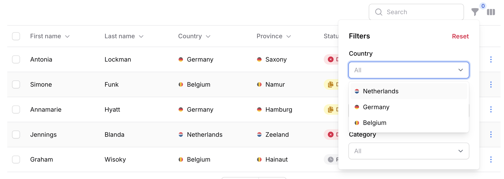
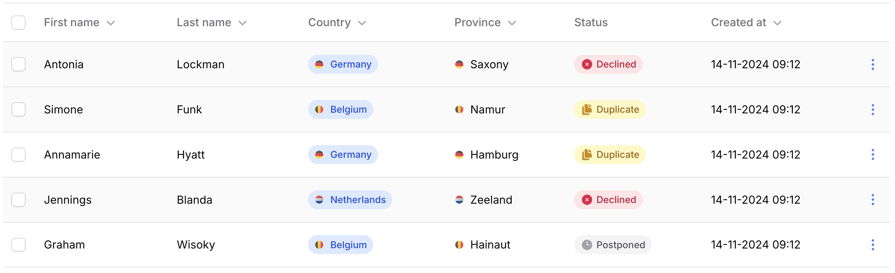
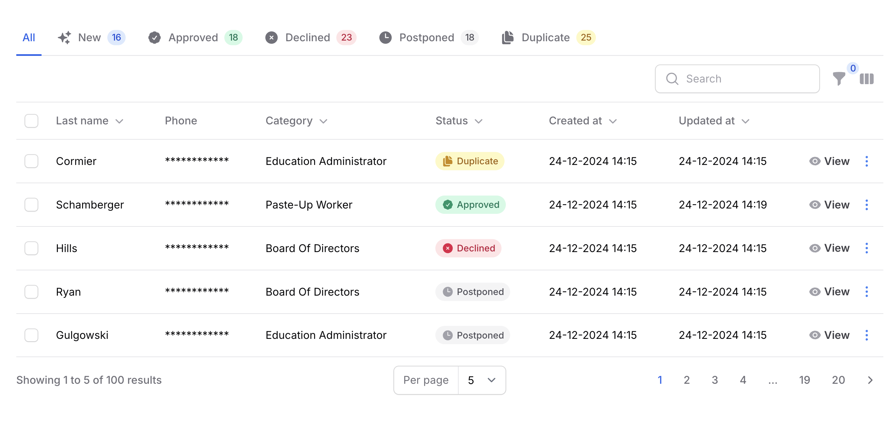

# Filament Advanced Components

This plugin extends existing **FilamentPHP 3** components with advanced features and enhanced functionality, offering more powerful and flexible options for your projects.

> [!NOTE]  
> All components are extending the default Filament components, so you can use them as you would use the default components without any issues. This package is designed to enhance the default components, not to replace them.

## Licences
You can buy a license for the plugin on the [AnyStack](https://checkout.anystack.sh/filament-advanced-components) website.

## Installation instructions

Filament Advanced Components uses AnyStack to handle payment, licensing, and distribution.

To install you'll need to add the repository to your composer.json file:

```json
{
    "repositories": [
        {
            "type": "composer",
            "url": "https://filament-advanced-components.composer.sh"
        }
    ]
}
```

Once the repository has been added to the composer.json file, you can install Filament Advanced Components like any other composer package using the composer require command:

```bash
composer require codewithdennis/filament-advanced-components
```

You will be prompted to provide your username and password. The username will be the email address and the password will be equal to your license key.

```bash
Loading composer repositories with package information
Authentication required (filament-advanced-components.composer.sh):
Username: [licensee-email]
Password: [license-key]
```

## Future plans
- [ ] The ability to add badges to a column.
- [ ] The ability to mask a column.
- [ ] The ability to add a download button to a column.

## Components

### Image (Prefix & Suffix)

You can add a prefix or suffix images `AdvancedTextColumn`, `AdvancedCheckboxList`, `AdvancedSelectFilter`, `AdvancedSelect`, and `AdvancedTextEntry` components. This allows you to add more context to the data you are displaying.



Here is an example of how you can add a prefix image to a column:

```php
AdvancedTextColumn::make('country.name')
    ->prefixImage(fn (Country $record) => asset('images/'.$record->image))
```

```php
AdvancedTextColumn::make('country.name')
    ->suffixImage(fn (Country $record) => asset('images/'.$record->image))
```

You can change the size of the image by passing a **size** option to the component.

```php
AdvancedTextColumn::make('country.name')
    ->prefixImage(fn (Country $record) => asset('images/'.$record->image))
    ->prefixImageSize(32) // Default: 16px
```

```php
AdvancedTextColumn::make('country.name')
    ->suffixImage(fn (Country $record) => asset('images/'.$record->image))
    ->suffixImageSize(32) // Default: 16px
```

Do you have a badge-able column? No worries, the image will be displayed inside the badge.



If you want to add extra attributes to the image, you can use the **prefixImageExtraAttributes** or **suffixImageExtraAttributes** methods.

```php
AdvancedTextColumn::make('country.name')
    ->prefixImage(fn (Country $record) => asset('images/'.$record->image))
    ->prefixImageExtraAttributes([
        'class' => 'pr-4',
        'style' => 'background: red'
    ])
```

```php
AdvancedTextColumn::make('country.name')
    ->suffixImage(fn (Country $record) => asset('images/'.$record->image))
    ->suffixImageExtraAttributes([
        'class' => 'pr-4',
        'style' => 'background: red'
    ])
```

### Mailable

A simple way to make a value clickable and open the default mail client with the email address.

```php
AdvancedTextColumn::make('email')
    ->mailable()
```

If you want to apply a mailable based on a condition, you can pass a closure that returns a boolean value.

```php
AdvancedTextColumn::make('email')
    ->mailable(fn (string $state) => str($state)->endsWith('.com'))
```

### Callable

A simple way to make a value clickable and open the default phone client with the phone number.

```php
AdvancedTextColumn::make('phone')
    ->callable()
```

If you want to apply a callable based on a condition, you can pass a closure that returns a boolean value.

```php
AdvancedTextColumn::make('phone')
    ->callable(fn (string $state) => str($state)->startsWith('+')),
```

### WhatsApp

A simple way to make a value clickable and open the default WhatsApp client with the phone number.

```php
AdvancedTextColumn::make('phone')
    ->whatsappable()
```

If you want to apply a WhatsApp-able based on a condition, you can pass a closure that returns a boolean value.

```php
AdvancedTextColumn::make('phone')
    ->whatsappable(fn (string $state) => str($state)->startsWith('+')),
```

### Masked
If you want to mask a value on a `AdvancedTextColumn` or `AdvancedTextEntry`, you can use the **masked** method.

> [!NOTE]  
> The value will only be masked on the frontend



```php
AdvancedTextColumn::make('phone')
    ->masked()
```

If you want an alternative mask, you can pass a string to the **masked** method.

```php
AdvancedTextColumn::make('phone')
    ->masked($mask = '█')
```
